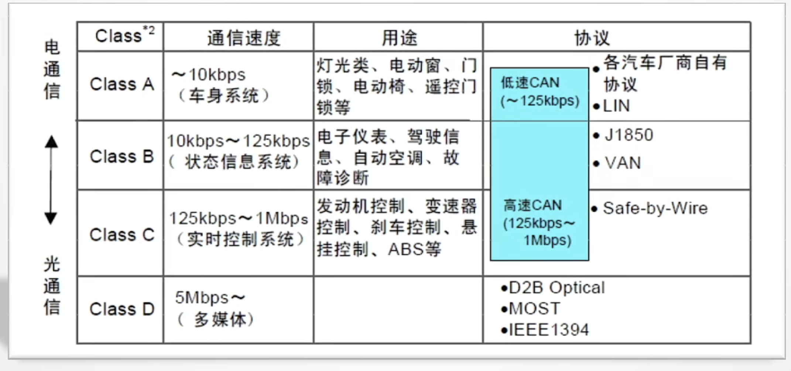
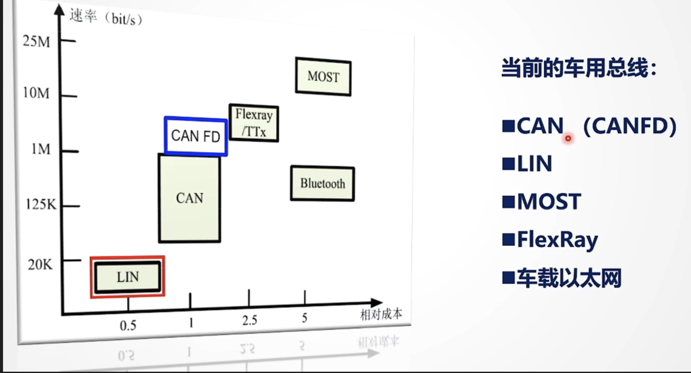
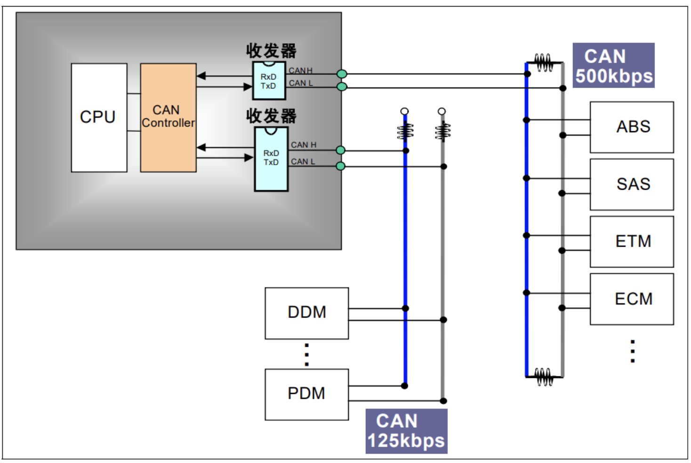
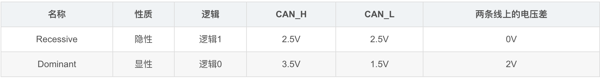
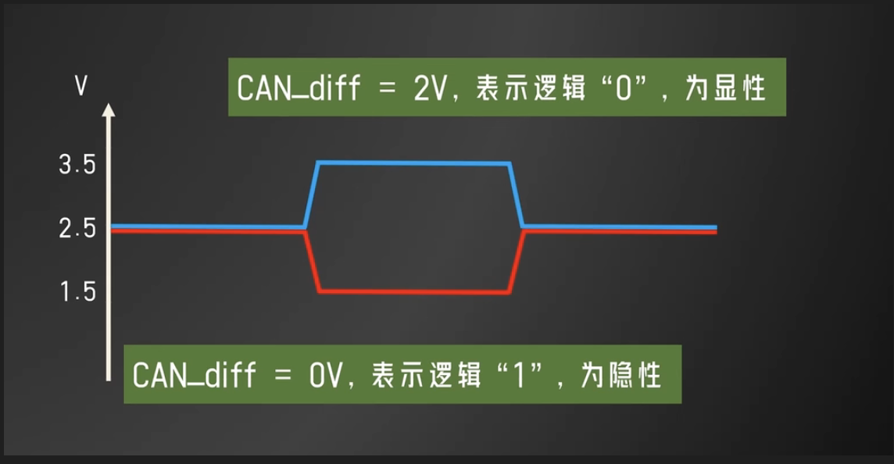
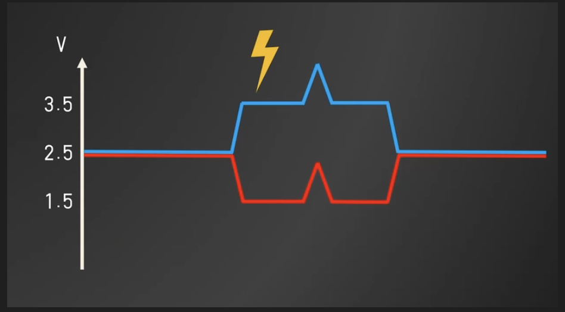
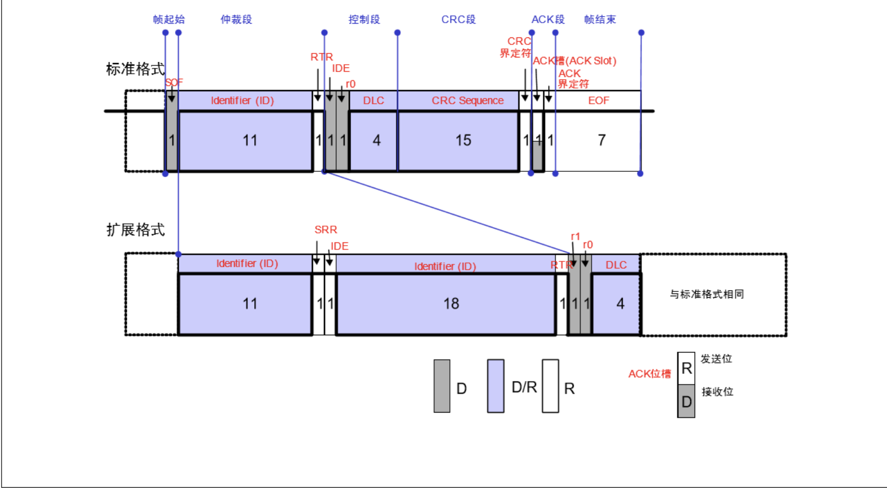
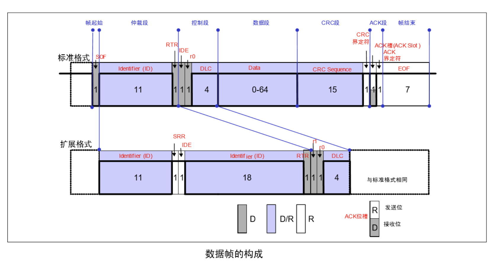
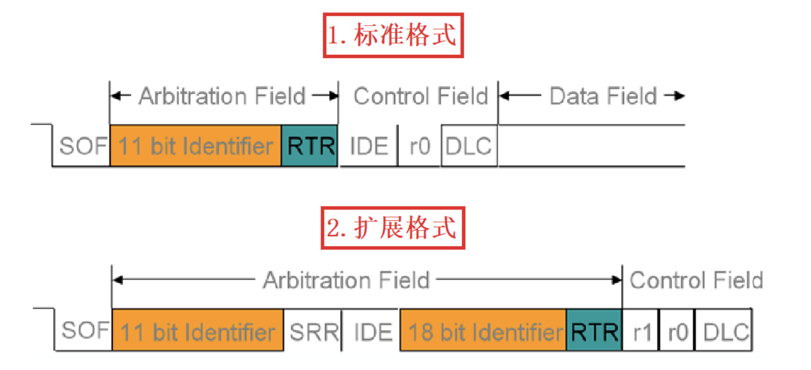
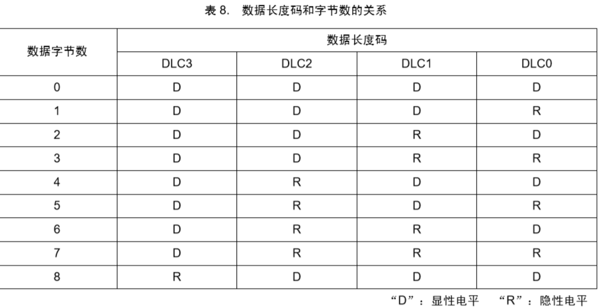

## 什么是CAN总线？

### 概述

`CAN`(*Controller Area Network*)是二十世纪八十年代初德国Bosch公司为解决现代汽车中众多电控单元（`ECU`——*Electric Controll Unit*)之间的数据交换而开发的一种多主机局部网络`串行通讯协议`。

### CAN发展时间线

> + 1983年 由Bosch和Intel共同开发
>
> + 1986年 Bosch在SAE大会上正式公布CAN协议
>
> + 1987年 Intel和Philips先后推出CAN控制器芯片
>
> + 1991年 Bosch颁布CAN2.0技术规范（分为a，b两个部分）
>
> + 1991年 CAN最早在Benz S系列轿车上实现
>
> + 1993年 ISO颁布CAN国际标准ISO-11898（这个国际标准下是高速CAN，在ISO-11519中规定了低速容错CAN）
>
> + 1994年 Cia组织举办第一届国际CAN大会（iCC）
>
> + 2005年 Cia在中国举办了第一场CAN研讨会
>
> + 2015年 CAN FD的ISO标准化
>
> + 2020年 CAN XL登场第十七届iCC大会

#### CAN总线在汽车网络上的应用以及CAN总线和其他现场总线的对比（速率与经济性）

## 为什么采用CAN？

#### 传统方案的弊端

过去，汽车通常采用常规的``点对点通信方式``将电子控制单元及电子装置连接起来，但随着电子设备的不断增加，导线数量也随之增多，让整个系统变得更为笨重，成本也很高。

#### CAN总线的优势

1. 从传输速度角度
   + 数据传输速度相对较高，可达到`1 Mbit/s`。（此时距离最长`40m`；通信距离最远可以达到10km，但是速率会降到5kbps以下）（CAN-FD和CAN-XL分别可以达到2 Mbit/s和10 Mbit/s。）
2. 从成本角度
   + `多主通信模式`，从而降低节点设计成本
   + 采用``双绞线``作为通信介质，从而降低布线成本
3. 从可靠性角度
   + 采用``差分数据线``，抗干扰能力强
   + 使用`CRC`校验方式，具有错误侦听的自我诊断功能，通信可靠信较高
   + 报文帧仲裁失败或传输期间被破坏有`自动重发机制`
   + 节点在错误严重的情况下，具有`自动脱离总线`的功能，切断与总线的联系，不影响总线的正常工作（错误帧自我诊断）
4. 从实时性角度
   + 采用短帧结构，报文帧的有效字节数是`8`个
   + 报文ID越小，优先级越高。报文ID分为不同的优先级，进一步满足网络报文的实时性要求
   + `非破坏性总线仲裁处理机制`
5. 驱动单元数量角度
   + 理论上可以带动`110个`节点

## CAN总线理论知识学习

### CAN总线硬件连接以及相关概念介绍

(图中ABS，SAS等模块就是汽车上的各个ECU节点)

+ 一个节点包含三个主要部分，`微控制器、CAN控制器、CAN收发器`

  + `CAN收发器`：进行数字信号和模拟信号的转换（在总线上传输的是模拟信号，而微控制器处理的是数字信号，在中间需要一个``模数转换``的桥梁，CAN收发器的部分职责就是模数信号的转换）
  + `CAN控制器`：从控制单元中的微控制器接收数据，处理数据并将其传输到CAN收发器。同时，CAN控制器还接收CAN收发器接收到的数据，对数据进行处理，并将其传输给微处理器。
  + 有的微控制器内部已经集成了CAN控制器，所以在电路连接时可以省略CAN控制器

+ 所有节点通过两条线连接起来。两条线分别称为`CAN_H`和`CAN_L`。如果要求不高，一般用``带屏蔽的双绞线``就可以了

+ 网络的两端必须有`120Ω的终端电阻`。所以在设计线路板的时候都要有一个120欧的电阻。

### CAN总线物理电气特性

#### 差分电平传输

##### 什么是差分电平信号传输？

+ CAN BUS上的电平信号(CAN_diff)在模拟量上等于CAN_H电平与CAN_L电平的差值（即`CAN_diff=CAN_H-CAN_L`)

+ 收发器发送的数字逻辑信号和总线上的模拟信号对应如下

+ 

  > **注：** 1）CAN标准有两个，即IOS11898和IOS11519，两者差分电平特性不同。这里讲的是IOS11898
  >
  > 2）不同类型CAN总线相应的CAN_H和CAN_L值也不尽相同
  >
  > 

+ 实例：当CAN控制器向总线上发送逻辑“1”时，CAN收发器将逻辑“1”的数字信号转换为CAN_H上的模拟电平2.5V、CAN_L上的模拟电平2.5V，总线上传递的CAN_diff即为0V，这是一个隐形电平

##### 为什么采用差分信号传输？

+ 采用差分信号可以提高信号传输的鲁棒性，减少外界噪音的干扰，如下图所示

+ 当外界输入噪声时，CAN_H和CAN_L会产生相同的波动，CAN_diff值不受影响

### CAN报文帧种类

| 序号 | 名称   | 用途                                                         |
| ---- | ------ | ------------------------------------------------------------ |
| 1    | 数据帧 | 用于发送单元向接收单元传送数据的帧。                         |
| 2    | 遥控帧 | 用于接收单元向具有相同 ID 的发送单元请求数据的帧。           |
| 3    | 错误帧 | 用于当检测出错误时向其它单元通知错误的帧。 （硬件自动完成）  |
| 4    | 过载帧 | 当一个节点正忙于处理接收的信息,可以通知其它节点暂缓发送新报文。（硬件自动完成） |
| 5    | 帧间隔 | 用于将数据帧及遥控帧与前面的帧分离开来的帧（硬件自动完成），由三个连续的隐性位构成 |

+ `错误帧`、`过载帧`、`帧间隔`都是硬件自动完成的，无法由软件实现控制。对于使用者而言，只需要掌握`数据帧`和`遥控帧`
+ 数据帧和遥控帧又分为`标准格式`和`扩展格式`
+ 标准格式有`11位`标识符，而扩展格式有`29位`标识符

#### 遥控帧结构图

#### 数据帧结构图

+ 可以看出——数据帧和遥控帧最明显的区别就是有没有`数据段`

#### 帧结构各段详解

| 序号 | 名称   | 描述                                                  |
| ---- | ------ | ----------------------------------------------------- |
| 1    | 帧起始 | 表示帧的起始，产生一个bit的显性电平（逻辑0）          |
| 2    | 仲裁段 | 表示帧的优先级，由标识符（ID）和传送帧类型(RTR)组成。 |
| 3    | 控制段 | 表示数据的字节数，由6个bit组成                        |
| 4    | 数据段 | 数据发送的具体内容，可产生0-8个字节的数据             |
| 5    | CRC段  | 校验传输帧的正确性                                    |
| 6    | ACK段  | 表示确认是否正常接受                                  |
| 7    | 帧结束 | 表示此帧结束，由七个连续的隐性电平构成                |

##### 什么时候认定总线空闲？

+ 当连续监测到`11个隐形位`时认定总线空闲（bus idle），即7（帧结束）+4（帧间隔）+1（SOF，SOF只有为显性电平时会启动一个新的帧，监测到0就是没有发送新的帧，即总线空闲）

##### 仲裁段

+ 仲裁段里含有CAN通信中一项非常重要的信息`（ID）`，你可以把它当成是每一个报文的名字，每个CAN device可以发送多条不同的ID报文。每一个总线节点的CAN控制器中都有一个东西叫`过滤器`，通过设置相关寄存器能够配置它，一旦设置好，CAN控制器会根据你的设置，自动去判断要不要接收报文，这部分完全由硬件实现，这个判断要不要接收的过程，也叫过滤，判断的依据就是每个报文的ID。

+ 扩展格式的ID具有比标准格式更多的位数，从而有更高的ID容量

  

+ 标准格式的标识符长度的是11位，紧随其后的是`RTR位，用于表明此帧是数据帧还是远程帧`（逻辑0是远程帧，逻辑1为数据帧）。`IDE位用于表明此帧是标准帧还是扩展帧`（逻辑0为标准帧，逻辑1为扩展帧）。
+ 扩展格式的标识符长度的是29位，紧随其后的是RTR位，用于表明此帧是数据帧还是远程帧。IDE位用于表明此帧是标准帧还是扩展帧。

##### 控制段

+ 控制段含有`保留位(r0,r1)`和`数据长度码(DLC)`

+ 保留位（r0、r1) 必须全部以`显性电平(逻辑0）`发送。但接收方可以接收`显性、隐性及其任意组合的电平`。
+ 数据长度码（DLC） 与数据的字节数的对应关系下表所示。数据的字节数必须为 0～8字节。`但接收方对 DLC=9～15的情况并不视为错误。`

##### 数据段

+ 数据段就是你需要发送的数据，可能包含字符`0~8个字节数据`，CAN控制器有对应的寄存器，只需要把数据直接填进去就可以了。

### CAN总线仲裁方式

CAN总线采用的是一种`非破坏性总线仲裁方式`

+ 在总线空闲时，刚开始发送的节点获得发送权，一旦开始发送，就`不会被别的节点抢占`

+ 如果多个节点在总线空闲时同时发送，各发送节点从仲裁段的第一位开始进行仲裁。`连续输出显性电平最多的节点可继续发送`。(基于`CAN总线线与规则`)

  

## 参考资料

### 

> > 视频资源
> >
> > + [广州虹科电子CAN总线技术基础培训合集](https://www.bilibili.com/video/BV1gD4y1U7bJ/?spm_id_from=333.337.search-card.all.click&vd_source=2d5ec0a230549ed2b672ea4be8a2cc58)
> > + [CAN通信速成，从会到不会～](https://www.bilibili.com/video/BV1Dq4y1J7WA/?spm_id_from=333.337.search-card.all.click&vd_source=2d5ec0a230549ed2b672ea4be8a2cc58)
>
> > 博客资源
> >
> > + [CAN通信知识梳理及在Stm32上的应用（HAL库）](https://blog.csdn.net/weixin_44793491/article/details/107298426?ops_request_misc=%257B%2522request%255Fid%2522%253A%2522167306687716800211536038%2522%252C%2522scm%2522%253A%252220140713.130102334..%2522%257D&request_id=167306687716800211536038&biz_id=0&utm_medium=distribute.pc_search_result.none-task-blog-2~all~top_positive~default-1-107298426-null-null.142^v70^pc_new_rank,201^v4^add_ask&utm_term=CAN%E9%80%9A%E4%BF%A1%E7%9F%A5%E8%AF%86%E6%A2%B3%E7%90%86&spm=1018.2226.3001.4187)

