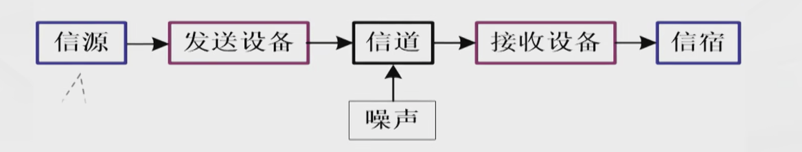
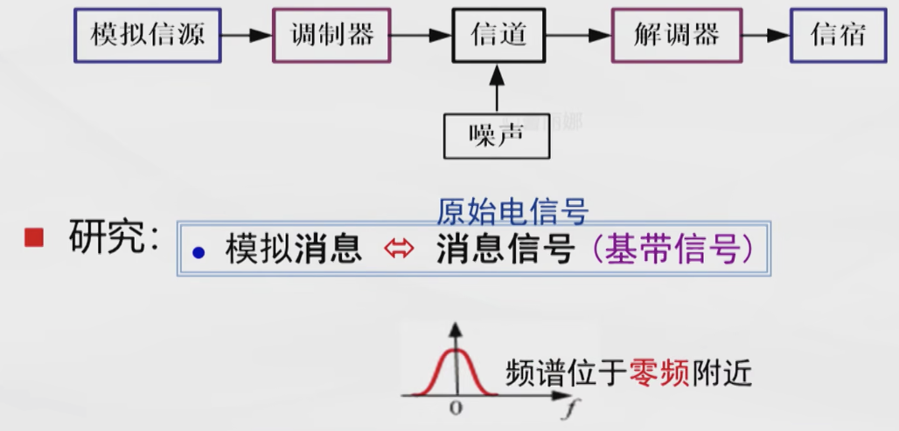
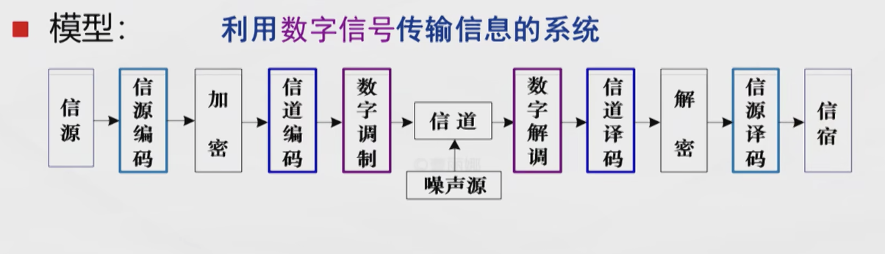
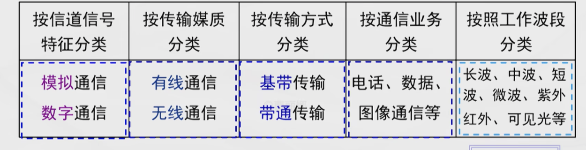
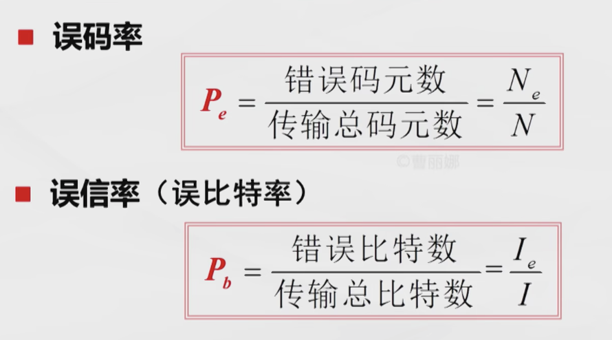

# 技术文件——20221228工作日志			拟制：解辰锋

# 本文中的所有信息均为清华大学内部消息，不得向外传播

# 1.学习记录

### 一.通信原理内容学习

+ 信使三姐妹：信息、消息、信号
  + 消息是信息的物质载体、信息的外在表现形式；信息是消息的内涵，是消息中包含的有效内容
  + 信号是消息的传输载体、消息的电表示形式
+ 通信的定义：利用电信号传递消息中所包含的信息
+ 系统三要素：物质、能量、信息
+ 通信系统的一般模型

+ 模拟通信系统

  
+ 数字通信系统（研究编码、译码、调制、解调、同步）

+ 数字通信系统的优点
  + 抗噪声能力强
  + 传输差错可控
  + 易于处理、变换、存储
  + 易于集成和加密
  + 易于将来自不同信源的信号综合传输
+ 数字通信系统的缺点
  + 可能需要较大的传输带宽
  + 对同步要求高
+ 基带传输和带通传输的区别

根据信道中传输的信号是否经过调制，将系统分为基带传输系统和带通传输系统。即经过调制的数字传输系统就是数字带通传输系统，未经过调制的传输系统就是数字基带传输系统。

+ 通信系统分类

+ 信息的度量

  + 信息量 I：衡量消息中不确定性的大小，可以用概率衡量

  $$
  I=log_a(\frac{1}{P})
  $$

  注：不同的底信息量I所对应的单位也不同（a=e，单位为nat；a=10，单位为Hartley；a=2，单位为bit）

  + 信源熵H：信源的平均信息量，在等概率时取最大值，最大值为$log_2n$,单位为b/symbol,用来描述信源的不确定度，其中n为信源进制数
+ 通信系统的性能指标

  矛盾的一对性能指标

  + 有效性

    + 模拟通信：传输带宽
    + 数字通信：传输速率、频带利用率

      + 码元传输速率（$R_B$:单位时间传递的码元（符号个数））
      + 信息传输速率（$R_b$:单位时间传递的比特数（信息量））
      + 波特率决定传输带宽；比特率反映传输效率.二者存在数学关系

      $$
      R_b=R_B*H
      \\
      R_b=R_B*log_2M(等概时)
      $$

      + 频带利用率：单位带宽内的传输速率

      $$
      \eta=\frac{R_B}{B}
      \\
      \eta_b=\frac{R_b}{B}
      $$
  + 可靠性

    + 模拟通信：输出信噪比
    + 数字通信：差错概率
      + 误码率
      + 误比特率
      + 
+ 信道

  + 定义：以传输媒质为基础的信号通道

## 参考资料

### 视频资源

### 博客资源

# 2.问题

# 3.下一步计划

# 本文中的所有信息均为清华大学内部消息，不得向外传播
