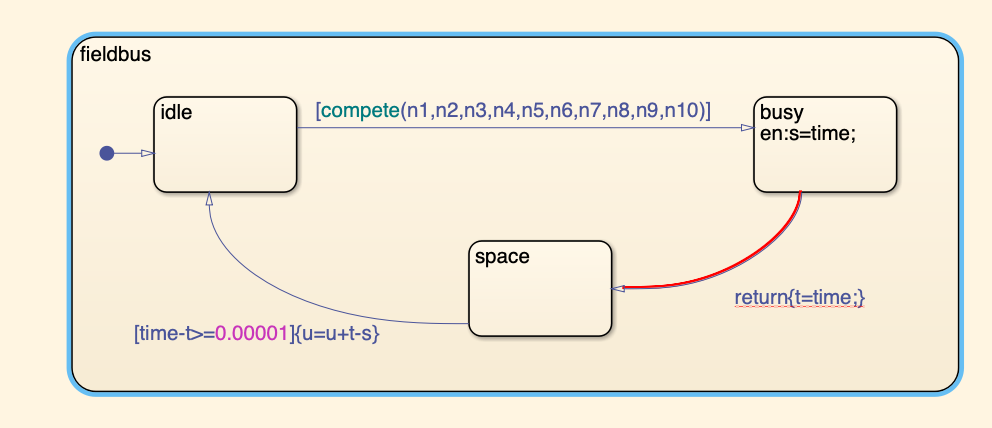
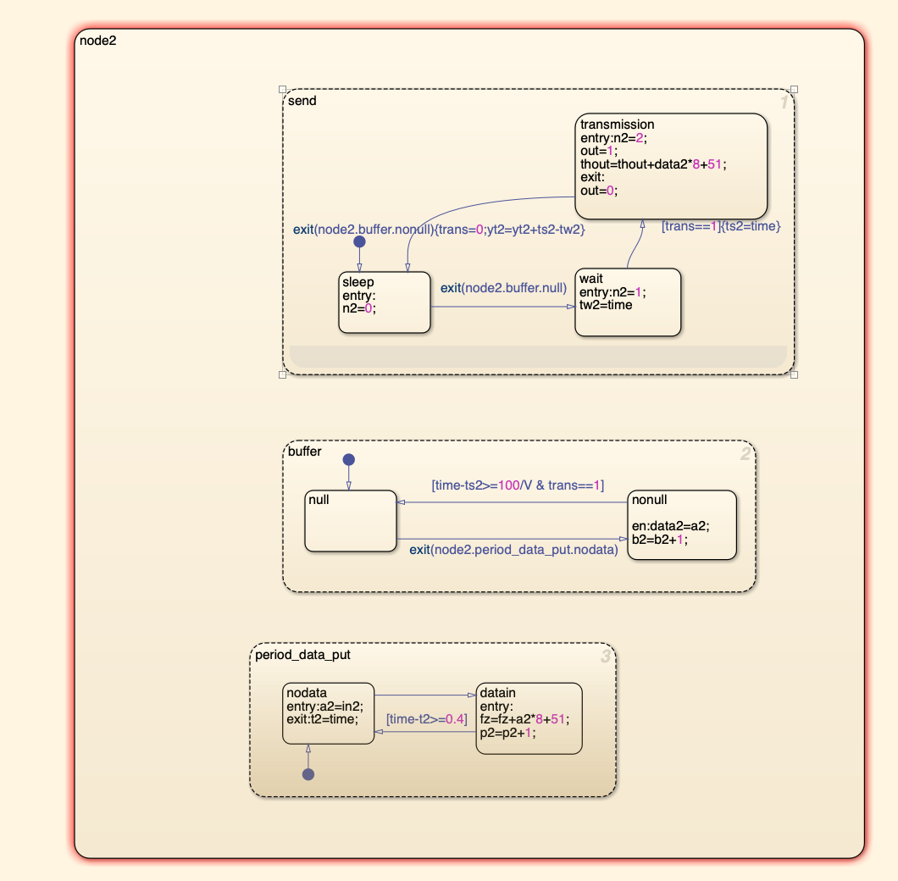
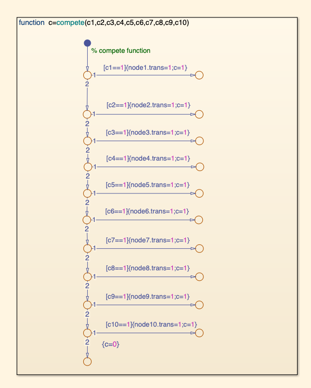
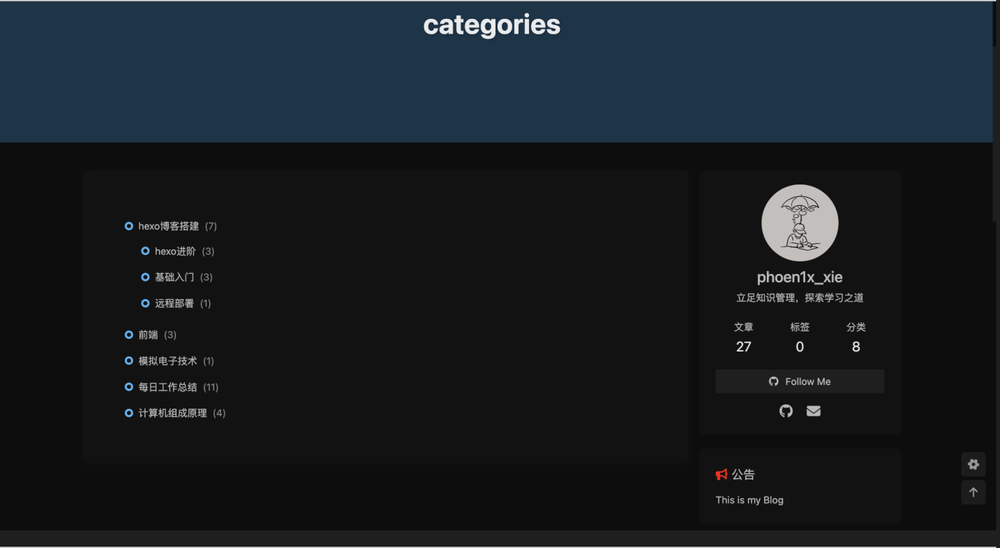

# 技术文件——20230103工作日志			拟制：解辰锋

# 本文中的所有信息均为清华大学内部消息，不得向外传播

# 1.近期总结

### 工作一：文献调研

在知网上搜索资料，对CAN网络的建模和优化策略做了一定的梳理，大致方向与思路有：

+ CAN节点拓扑结构优化
  + 代表论文题目：航空发动机分布式控制通讯网络拓扑结构优化
  + 摘要：针对航空发动机分布式控制系统通讯网络拓扑结构的构架问题,建立航空涡扇发动机机匣模型,选取具有代表性的10个传感器作为控制节点开展研究。同时考虑发动机表面存在通讯总线不可通过区域,以及控制节点的工作可靠性因其重要程度存在差异的约束条件,利用**==遗传算法==**对航空发动机分布式控制系统通讯网络的拓扑结构进行优化设计。结果表明:优化过程简单,并且优化得到的通讯网络拓扑结构在满足约束条件的基础上线束总长度最短。
  + 遗传算法之前接触过，目前看来该算法比较可行，后续考虑复现一下

+ CAN控制策略
  + 代表论文题目：航空发动机分布式系统状态反馈周期事件触发控制
  + 摘要：为平衡航空发动机分布式控制系统中总线服务质量与控制品质之间的矛盾，提出了一种基于线 性 矩 阵 不 等 式 理 论 的 周 期 事 件 触 发 机 制 与 保 成 本 控 制 器 协 同 设 计 方 法 。 基 于 输 入 到 状 态 稳 定（IS S）定 理 ，构 造 周 期 事 件 触 发 控 制 下 闭 环 系 统 渐 进 稳 定 的 充 分 条 件 ，并 给 出 了 控 制 器 增 益 与 成 本 函 数 上 界 的 求 解 方 法 ；考 虑 网 络时延的影响，利用分段 Lyapunov 泛函，建立时延下闭环系统的稳定性判据，并对系统的时延稳定裕度进行求 解和验证。仿真结果表明 ，在所求解的事件触发机制与控制器联合作用下 ，闭环系统获得了较好的控制性能 。 当触发参数设定值为 0. 4 时，系统具有 0. 454s 的时延稳定裕度，且通信资源节省率达到了 83%
  + 对这类算法比较陌生，目前论文复现还没什么头绪，只是有这样一个方向

+ 通讯协议设计
  + 代表论文题目：CAN总线通讯协议设计
  + 摘要：通过对CAN通讯系统需要分析,可确定CAN通讯系统的通讯周期、工作方式、码速率。其约束条件包括系统工作周期、通信协议约束、通信格式约定、多字节数据及位标记。分析各个数据的优先级与传输途径确定编码规则,制定CAN通讯协议,可建立高效可靠的CAN通讯系统。
  + 比较陌生，还需要调研更多的论文

+ CAN调度策略（主要涉及到一些动态调度算法）
  + 代表论文题目：CAN网络层次化动态调度策略设计与实现
  + 摘要：CAN总线是一种基于消息的事件触发通信服务，主要应用于汽车、机器人等实时通信系统.CAN总线上有多个节点互相独立工作，当多个节点访问总线时出现消息碰撞，由于CAN总线采用按位仲裁算法决定节点访问总线的优先级，导致低优先级节点访问失败，而高优先级节点继续传输消息，这种方式导致低优先级节点饥饿现象而丢失消息，因此CAN总线调度算法随之被提出.目前调度策略已从静态发展到动态，但是随着节点的增多，系统维护和调度难度增加，单条总线调度策略难以维持系统性能需要.因此本文考虑将系统中的节点挂载到多条CAN总线上构成CAN网络，针对CAN网络提出了一种层次化的动态调度算法，将节点优先级仲裁分为：单条总线本地优先级仲裁和系统全局优先级仲裁，确定系统优先级最高的节点，使其进行数据传输.利用MATLAB中的Stateflow工具，建立分层动态调度模型，依据CAN总线数据传输机制和仲裁机制，设计实现了节点模块、总线模块、函数模块等，在总线模块实现了两级调度.实验结果表明，本算法在增加了节点总数目的基础上，满足高优先级节点传输且避免了低优先级节点的饿死现象.
  + 选取这篇论文倒不是考虑到这篇论文研究的节点饥饿问题，而是这种层次化动态调度的思想、动态调度算法以及认识到stateflow可以作为CAN网络建模的工具

+ 其他

  + ###### 飞行器控制系统双 CAN 网络高层通讯协议设计

    + ###### 本文提出一种基于双 CAN 网络的数据传输方案，该方案不但可以备份总线网络，提高了系统可靠性，而且可以通过合理利用备份网络资源有效降低主网络总线负载率，提高网络实时性

    + CAN 总线规范只对数据链路层和物理层进行了定义，其仅能保证节点间无差错的数据传输，在实际多节点数据通讯应用场合中，除了基本的两层服务之外，还需要有更多服务的支持，这可以通过制定其高层通讯协议来实现。CAN 总线的高层网络协议可自行定义，或采用一些国际组织制定的标准协议如 CANopen 和 CANaerospace，但国际标准协议结构比较 复杂，针对性不强，考虑到飞行器的特殊工作场合，出于保密性角度，本系统采用自行制定保密性高和专用性强的高层通讯协议。

  + 航空发动机分布式系统状态反馈周期事件触发控制

    + 为保证分布式系统具有较好的控制品质，往往需要各节点高频采样，当相邻时刻的采样信息差异较小时，状态量和控制量的更新对系统性能的提升不会产生明显影响。因 此，大量的冗余信息被释放到总线网络，造成了通信资源的浪费。同时，由于带宽限制和网络共享等特点，当多个节点在同一时刻发送数据时，必须竞争才能获得网络的访问权，使网络丢包和堵塞事件频发，降低了网络的服务质量
    + 事件触发控制，通过合理地设计触发机制来限制数据包的发送，在保证系统控制性能的同时极大地降低了通信资源的占用，被认为是有效的策略。与周期采样控制相比，事件触发控制根据控制性能需求进行状态量和控制量的更新，在保证闭环系统性能的基础上，有效地减少了控制任务的执行数量，可以显著地节约计算资源和通信资源。
    + 相比于传统的事件触发控制，周期事件触发控制只在固定的采样周期进行触发条件的判断，避免了事件触发器对信号的连续检测

  + 基于数据压缩的车身CAN网络优化调度设计

    + 针对汽车车身网络节点日渐增多而低速CAN带宽资源有限的问题,引入减少网络传输数据的数据压缩技术,分析了车身网络信息数据变化特点,提出了基于数据压缩的变化优先（CF）的优化调度算法,介绍了CF算法的数据压缩、解压缩和调度原理,将CF算法应用于汽车车身控制系统设计,理论分析和实验验证的结果表明,该算法可显著降低车身CAN总线负载,改善信息的实时性,提高车身CAN总线的扩展灵活性。

对这些方向有了一个大致的想法后，开始考虑上手实操建模工作，调研可以通过什么计算机仿真软件——最后敲定了simulink的stateflow工具箱（基于有限状态机理论，进行系统行为建模）。

### 工作二：simulink学习和stateflow工具箱学习（进行中）

+ 学习stateflow和simulink的基本语法（之前用过一点点simulink，但是stateflow完全没用过，从零学起。。。）

### 工作三：论文复现工作（进行中）

+ 周末找到了一篇论文《基于人工智能的工业实时通信网络性能改进及评价》，里面对CAN建模的介绍是我看过的几篇论文中最详细的，所以准备对这篇论文进行复现
+ 当前进度
  + 基本摸清了建模思路，但是由于对语法不熟悉所以很多bug还在修复中

+ 当前建模进度
  + 总线模块
  + 
  + 节点模块
  + 
  + 仲裁函数模块
  + 

### 工作四：博客搭建与知识整理

+ 重新上线了博客，对功能和UI做了进一步完善
+ 零散地补一些没学过的课程，搭建知识体系

+ 网站链接

  + 国内gitee：https://phoenixgogogo.gitee.io/

  + 国外github：https://xiaoxietongxue.github.io/（没有加速器打开的话网页加载会有点慢，建议打开gitee）

## 参考资料

### 视频资源

### 博客资源

# 2.问题

# 3.下一步计划

# 本文中的所有信息均为清华大学内部消息，不得向外传播
