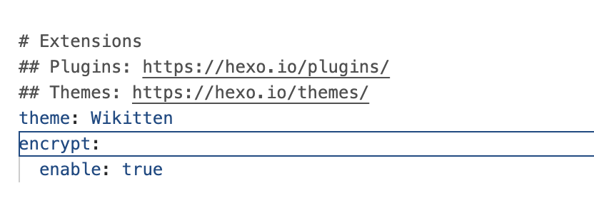
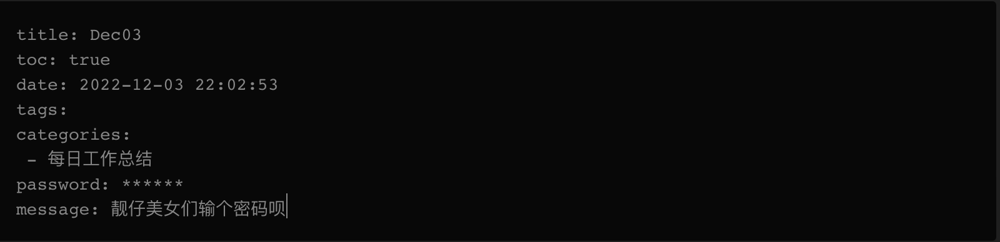
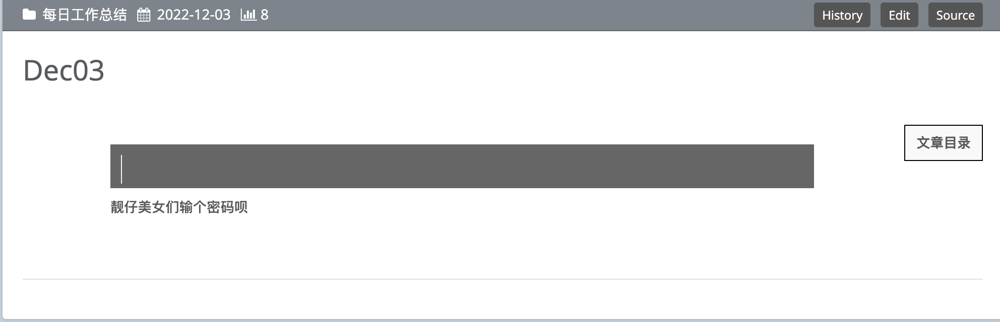

## 搭建环境

+ 在终端中安装支持加密功能的插件

```shell
npm install hexo-blog-encrypt
```

+ 修改全局配置文件_config.yml,加入encrypt属性



## 博文文章添加加密字段

举个🌰




## 效果展示

+ 运行博客，访问加密文章



## 参考资料

> - [(13条消息) Hexo博客设置文章加密_没有八个的博客-CSDN博客_hexo-blog-encrypt](https://blog.csdn.net/WwLK123/article/details/124436871#:~:text=今天给大家推荐一款适用于 Hexo 的静态博客 加密,插件： hexo-blog-encrypt ，搭配此插件你可以写一些比较私密的博客，通过密码验证的方式让其他人不能随意浏览。 1、安装插件)
