# CSS

## 通配符选择器

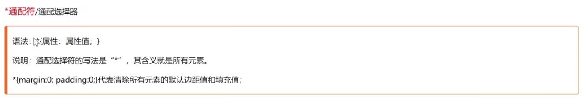

## 群组和后代选择器

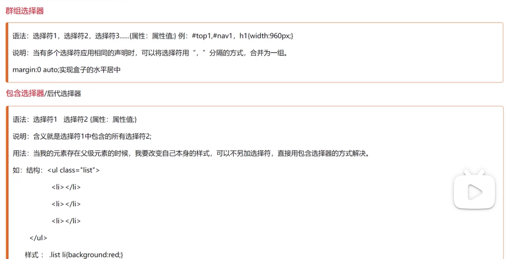

## 伪类选择器（简单实用）

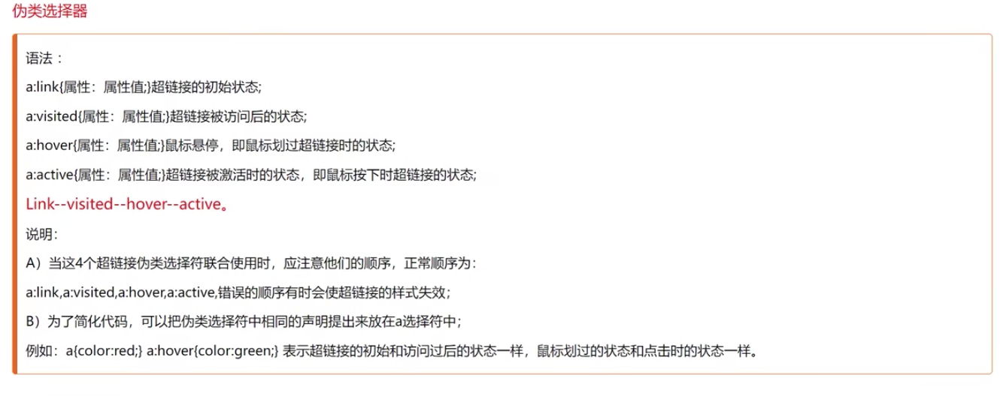

# Javascript(p184)

## 历史与背景

Netscape公司


## JS组成部分

+ HTML决定网页的内容
+ CSS决定网页的样式
+ JS决定网页的行为，主要由三部分构成
  + BOM（browser object model)——操作浏览器发生变化的属性和方法
  + DOM（document  object model)——操作文档流发生变化的属性和方法
  + ECMAScript——JS代码的书写规则

+ 图示JS作用


## JS代码的书写位置

+ 同CSS一样，也分为行内式、内嵌式、外链式
+ 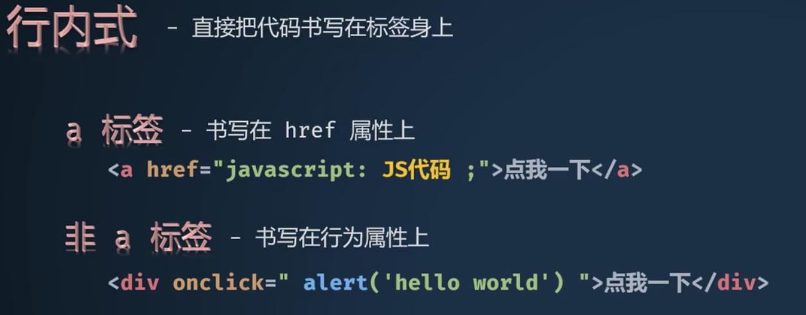


## JS变量

### 变量

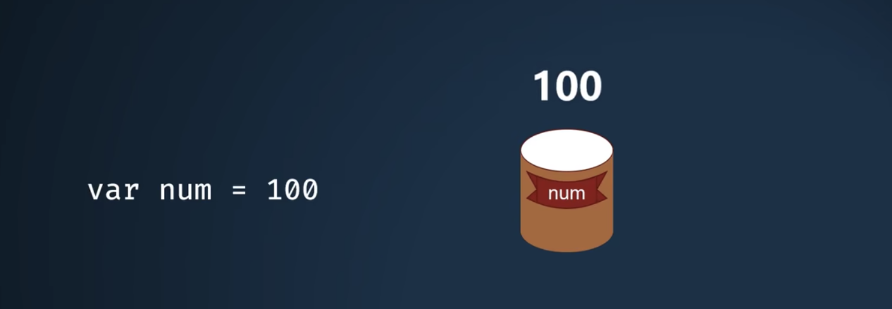

+ 命名规则同C语言近乎一致（不一样的地方是数字、字母、下划线的基础上加上了美元符）

+ 注释语句 //

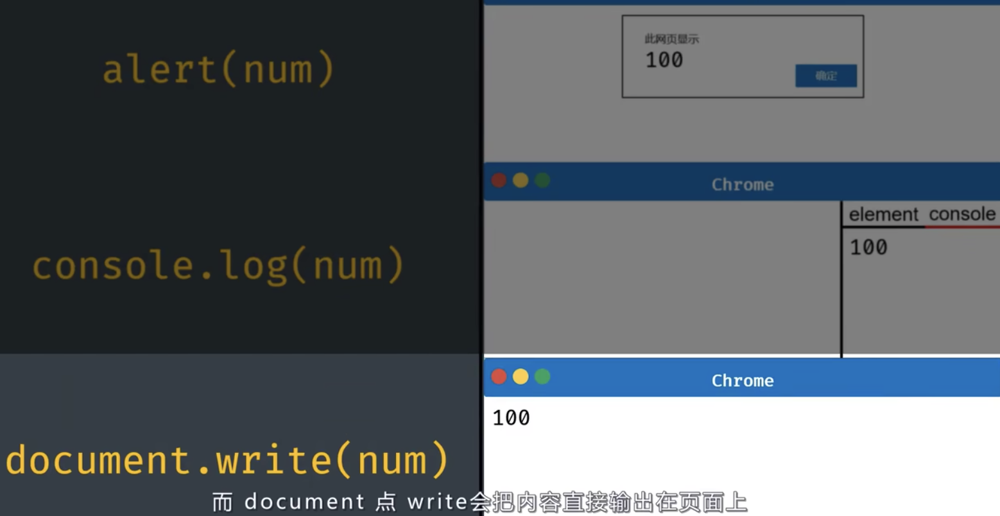

### JS数据类型

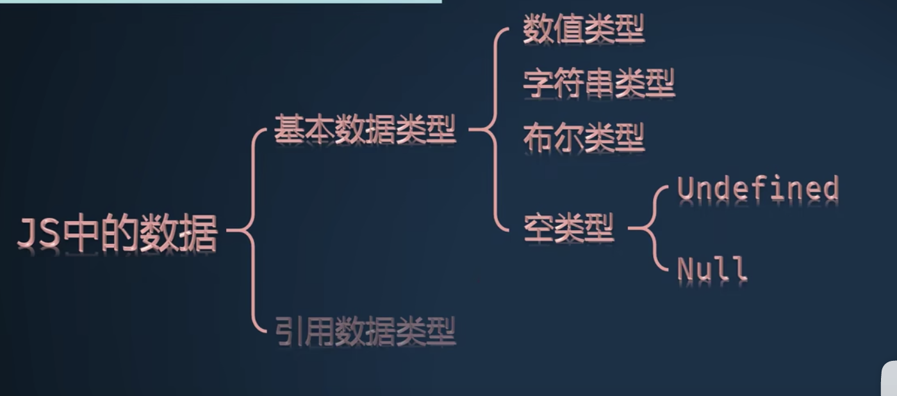

#### 数值类型

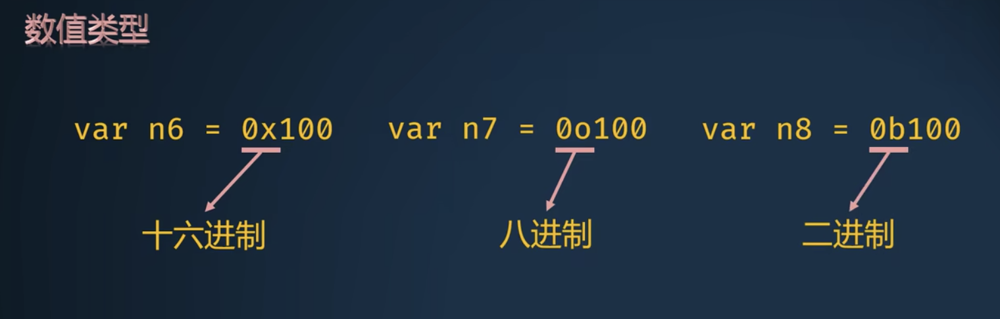

#### 字符串类型

+ 不区分单引号和双引号

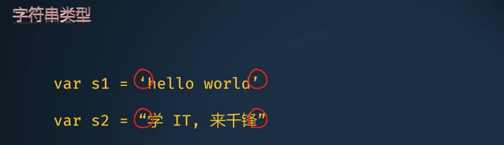

#### 布尔类型

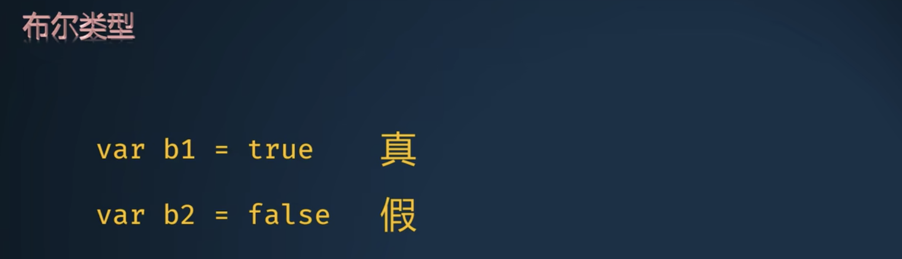

#### 空类型

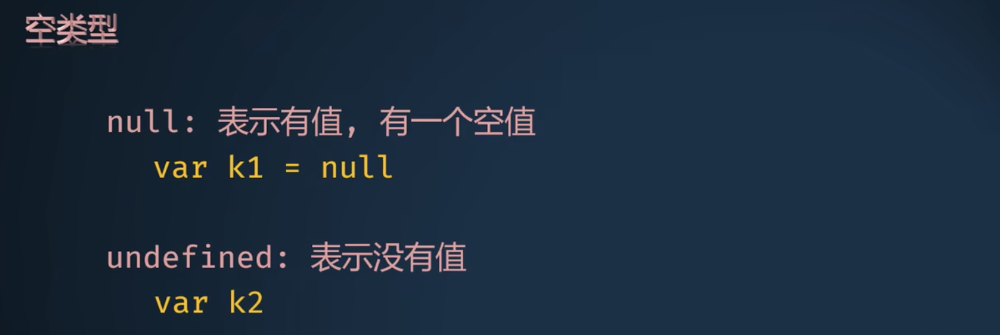

#### 数值类型检测手段

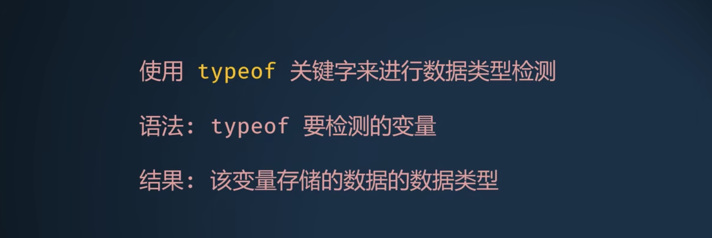

```javascript
var num=100
result=typeof num
console.write(result)
```

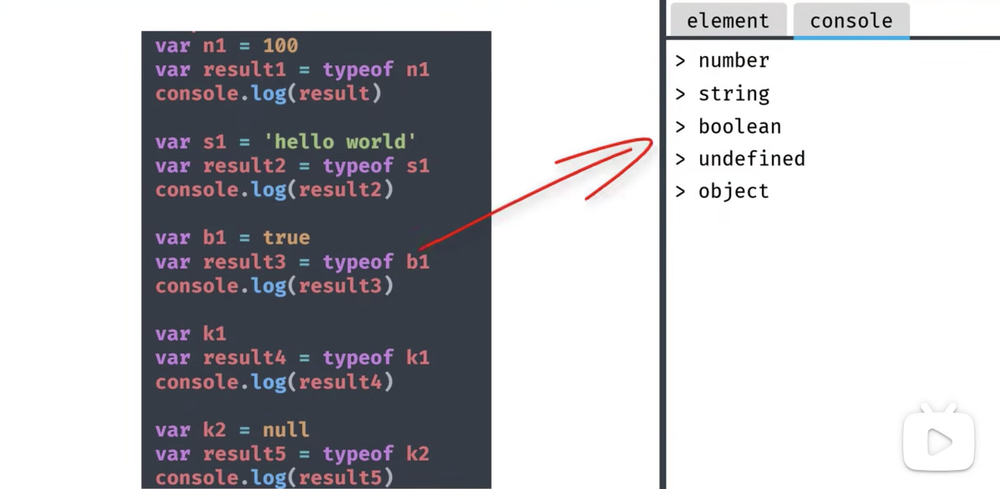

#### JS数据类型转换

##### 字符串到数字的转换

###### Number方法

```javascript
var s1='100'
console.log(typeof s1)

var s2=Number(s1)
console.log(typeof s2)
```

解析规则：

+ 如果字符串可以直接转换成数字，转换后的结果就是number
+ 如果字符串不能直接转换成数字，转换后的结果为NaN（Not a number)

###### parseInt方法

###### parseFloat方法

##### 转字符串
