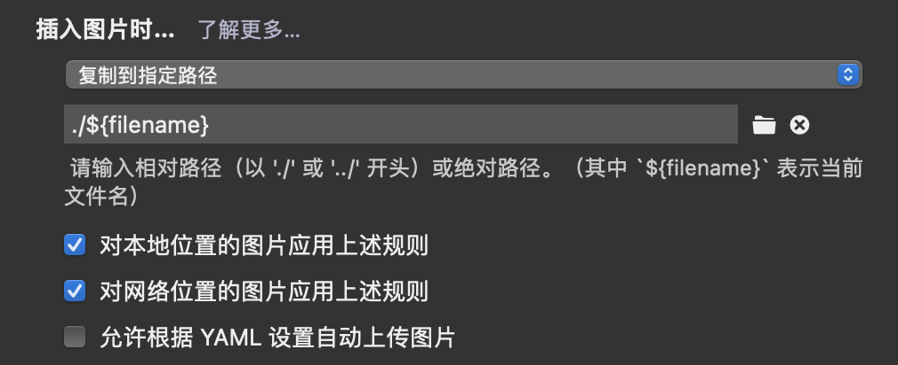

## 问题产生背景

+ 出于对云端图床可靠性的不信任，我将markdown博客中所用到的图片进行本地化存储（即另建一个文件夹存放文件中插入的图片的原件）

## 问题描述与解决

### 问题一：如何将博客连带图片一同推送到本地端口？

在此给出一种typora和博客推送联动，完成博客连带图片一体化推送的方案，需要以下步骤

+ 插件安装与配置——安装插件	*hexo-asset-image*

```shell
npm install https://github.com/CodeFalling/hexo-asset-image --save
```

但是这个插件的内容需要修改【不然可能会出Bug】

打开/node_modules/hexo-asset-image/index.js，将内容更换为下面的代码

```js
'use strict';
var cheerio = require('cheerio');

// http://stackoverflow.com/questions/14480345/how-to-get-the-nth-occurrence-in-a-string
function getPosition(str, m, i) {
  return str.split(m, i).join(m).length;
}

var version = String(hexo.version).split('.');
hexo.extend.filter.register('after_post_render', function(data){
  var config = hexo.config;
  if(config.post_asset_folder){
    	var link = data.permalink;
	if(version.length > 0 && Number(version[0]) == 3)
	   var beginPos = getPosition(link, '/', 1) + 1;
	else
	   var beginPos = getPosition(link, '/', 3) + 1;
	// In hexo 3.1.1, the permalink of "about" page is like ".../about/index.html".
	var endPos = link.lastIndexOf('/') + 1;
    link = link.substring(beginPos, endPos);

    var toprocess = ['excerpt', 'more', 'content'];
    for(var i = 0; i < toprocess.length; i++){
      var key = toprocess[i];
 
      var $ = cheerio.load(data[key], {
        ignoreWhitespace: false,
        xmlMode: false,
        lowerCaseTags: false,
        decodeEntities: false
      });

      $('img').each(function(){
		if ($(this).attr('src')){
			// For windows style path, we replace '\' to '/'.
			var src = $(this).attr('src').replace('\\', '/');
			if(!/http[s]*.*|\/\/.*/.test(src) &&
			   !/^\s*\//.test(src)) {
			  // For "about" page, the first part of "src" can't be removed.
			  // In addition, to support multi-level local directory.
			  var linkArray = link.split('/').filter(function(elem){
				return elem != '';
			  });
			  var srcArray = src.split('/').filter(function(elem){
				return elem != '' && elem != '.';
			  });
			  if(srcArray.length > 1)
				srcArray.shift();
			  src = srcArray.join('/');
			  $(this).attr('src', config.root + link + src);
			  console.info&&console.info("update link as:-->"+config.root + link + src);
			}
		}else{
			console.info&&console.info("no src attr, skipped...");
			console.info&&console.info($(this));
		}
      });
      data[key] = $.html();
    }
  }
});


```

+ 打开_config.yml文件，修改下述内容

```yaml
post_asset_folder: true
```

+ 做好这些准备工作后，进入typora写作工作流

  + 在写作中复制一张图片时，我们可以更改其保存在本地的路径，我们作如下配置

  

  + 这样复制一张图片后，图片的文件会自动保存在同目录下一个与博客文件同名的文件夹中。注意，这里的“同名”非常理想。因为一般利用hexo new指令新建一个文件后会生成一个与之同名的文件夹用来保存图片文件，这与typora的工作相同，所以经过typora上我们对图片的复制粘贴后，图片自然而然地符合了hexo对图片的路径逻辑

### 问题二：为什么按照前文所述的方法，有的图片在博客中显示，而有的却显示不了？

+ 经过比对，不能显示的图片有个共性——图片没有缩放。容易推测到，是图片的大小导致了图片渲染的失败，所以在typora中编辑图片的缩放值，再次进行测试，测试通过

## 参考资料

+ [(12条消息) hexo引用本地图片无法显示_Ericam_的博客-CSDN博客_hexo引用本地图片](https://blog.csdn.net/xjm850552586/article/details/84101345)

