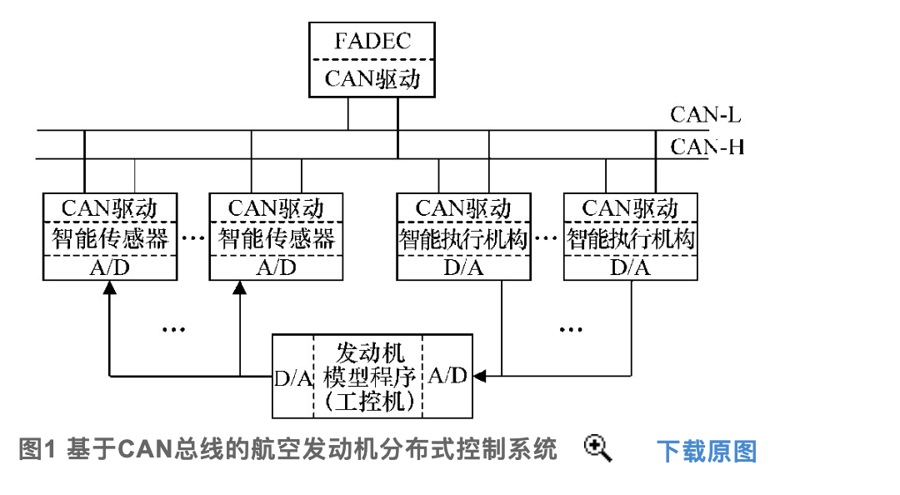
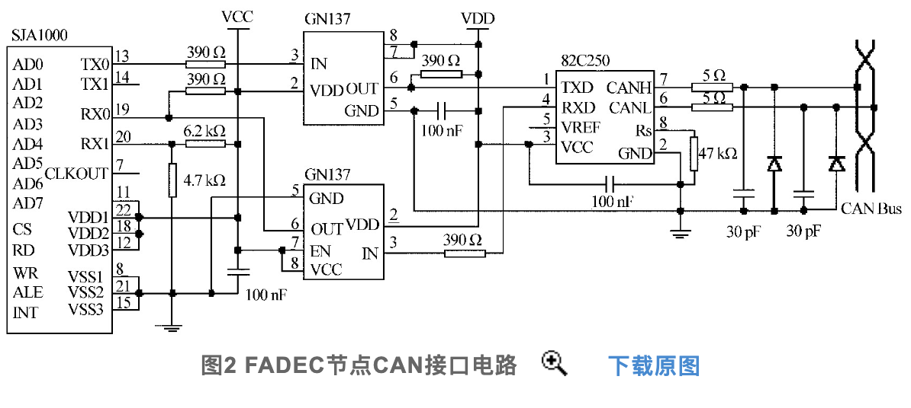
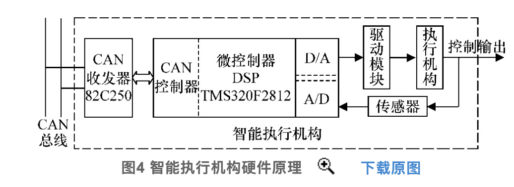
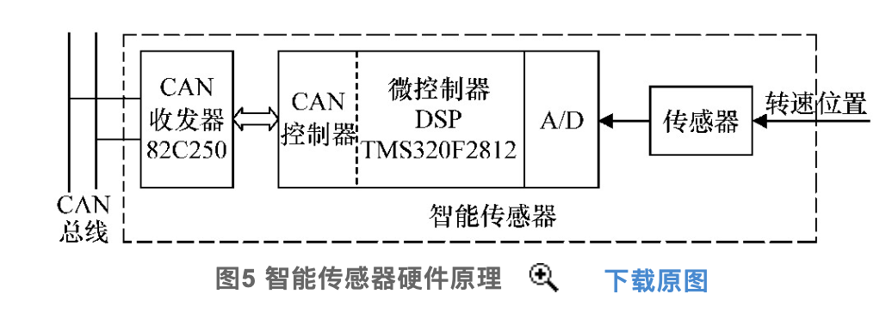
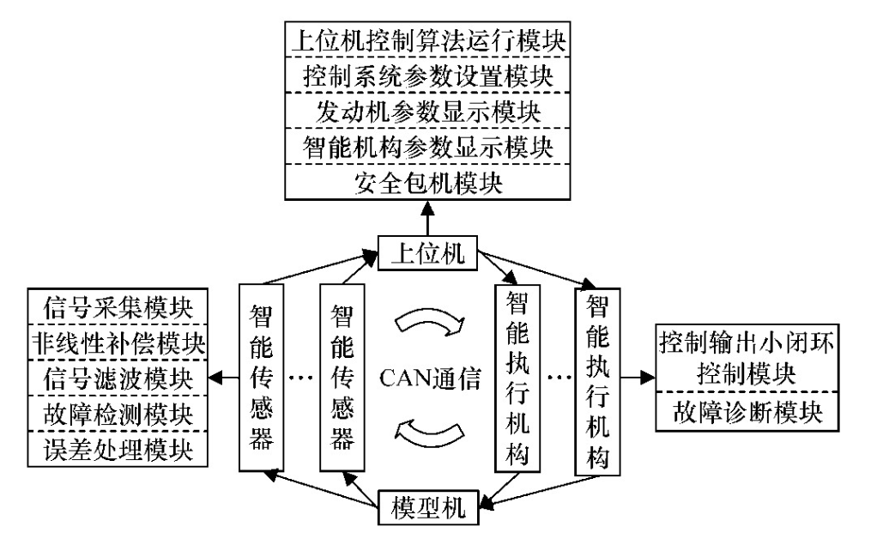

## 文献简介

| 题目         | 基于CAN总线的航空发动机分布式控制系统通信研究 |
| ------------ | :-------------------------------------------: |
| 作者         |          西北工业大学郭迎清教授团队           |
| 刊物（评级） |           测控技术（北大核心+CSCD）           |
| 时间         |                  2009-01-18                   |

+ 文章摘要：航空发动机控制系统发展趋势是`分布式控制系统`,`基于数据总线的通信技术`是分布式控制系统的关键。首先对基于CAN总线的航空发动机分布式控制系统中各节点(FADEC以及智能装置节点)进行了详细设计。然后结合航空发动机分布式控制系统要求设计了`CAN通信方案`。最后建立了`CAN通信验证平台`。实验表明设计的通信方案可以满足航空发动机分布式控制系统要求。

## 文献知识整理

### 系统总体设计

+ 选用CAN总线进行通信
+ 本设计的通信方案要求数据以`20 ms为周期`在控制回路中不间断准确传递,通信速率选为500 kb/s,分布距离小于40 m。

### 功能节点设计

#### FADEC设计

+ 由一台`研华工控机`实现
+ 为了接入CAN通信网络，设计了`CAN总线接口电路`,接口电路包括`独立的CAN通信控制器SJA1000`、`高性能CAN总线收发器82C250`,硬件电路图如下

> 为了增强CAN总线节点的抗干扰能力,SJA1000的TX0和RX0并不是直接与82C250的TXD和RXD相连,而是通过高速光耦6N137 后与82C250相连,这样就很好地实现了总线上各CAN节点间的电气隔离。
>
> [光电耦合器](https://baike.baidu.com/item/%E5%85%89%E7%94%B5%E8%80%A6%E5%90%88%E5%99%A8/10376823?fromtitle=%E9%AB%98%E9%80%9F%E5%85%89%E8%80%A6&fromid=10503187&fr=aladdin)
>
> [高速光耦和普通光耦的区别](https://www.21ic.com/article/888524.html)
>
> tips：图上的GN137个人感觉应该是标注错误了，应为6N137

+ FADEC控制程序软件

| 序号 | 模块                 | 功能                                                         |
| ---- | -------------------- | ------------------------------------------------------------ |
| 1    | 系统参数设置模块     | 通过FADEC设置整个系统的控制参数,包括主控程序控制参数以及智能装置参数设置 |
| 2    | 发动机参数显示模块   | 通过曲线、表盘、指示灯等实时显示发动机运行状态参数           |
| 3    | 智能装置参数显示模块 | 按用户要求显示智能装置的工作状态以及智能装置的故障情况       |
| 4    | 安全警报模块         | 向用户警报各种安全故障,如超温、超转、传感器故障等            |
| 5    | 数据接收与发送模块   | FADEC中的关键模块,直接影响到整个控制系统的正常运行           |
| 6    | 控制算法运行模块     | FADEC中的关键模块,直接影响到整个控制系统的正常运行           |

#### 智能装置设计

+ 智能装置采用`集成CAN控制器的DSP芯片TMS320F2812`+`CAN收发器82C250`的方案
+ 在智能执行机构中,为了形成对执行机构控制输出的“小闭环”控制,外加D/A、A/D转换模块、电机驱动模块、步进电机以及智能自整角机传感器,设计的智能执行机构硬件原理如图4所示。
+ 智能执行机构硬件配置

+ 智能传感器硬件配置

+ 传感器检测到发动机的运行状态参数后,经A/D转换模块进入DSP微控制器。经DSP芯片中非线性补偿、信号滤波、故障检测、误差处理等程序模块处理后,由CAN总线收发模块发送至FADEC节点。

### CAN总线通讯方案设计

### 

#### 通讯协议的设定

