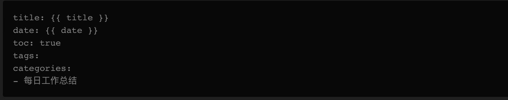
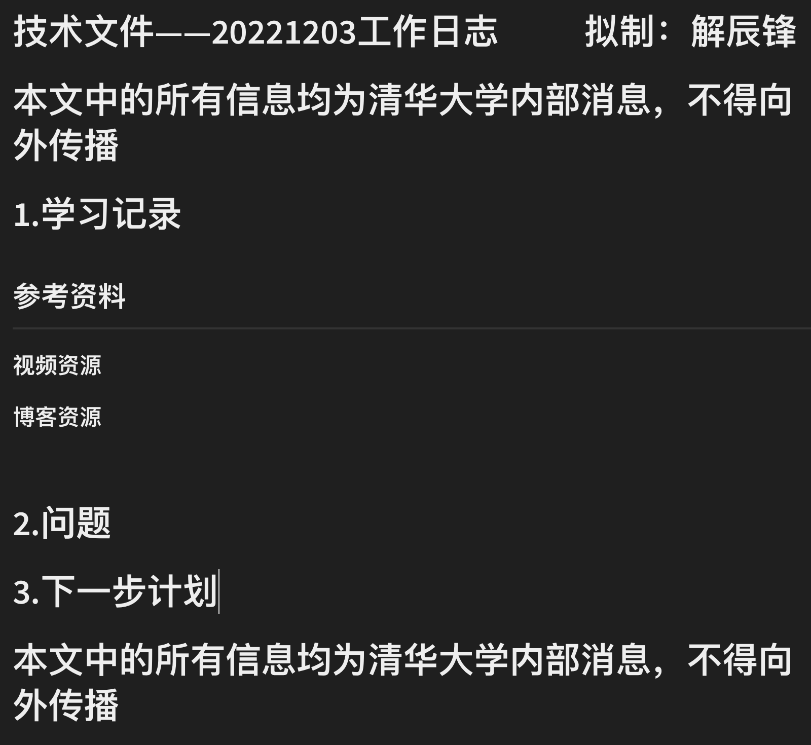

## 一.问题产生背景

+ 每日工作总结的格式固定，创建模版可以提高文档制作效率
+ 后文将以每日工作总结的制作为例

## 二.如何创建模版

+ 在hexo框架中，模版文件保存在博客项目目录下的scaffolds文件夹中，所以我们只需要在该目录下创建md文件，书写模版内容即可
+ 首先我创建md文件，文件名称为dailywork.md
+ 在模版文件开头不要遗漏Front matter内容，如下是我的个人总结的Front matter格式



+ 正文正常编辑md文件，我制作的格式如下




## 三.如何使用模版

在新建文件时，只需要在终端中输入下列命令即可(Dec06.md是我想创建的文件的文件名，dailywork是模版文件名)

```shell
hexo new dailywork Dec06
```

