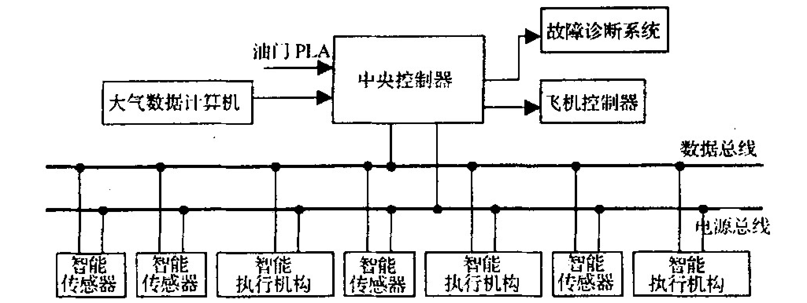
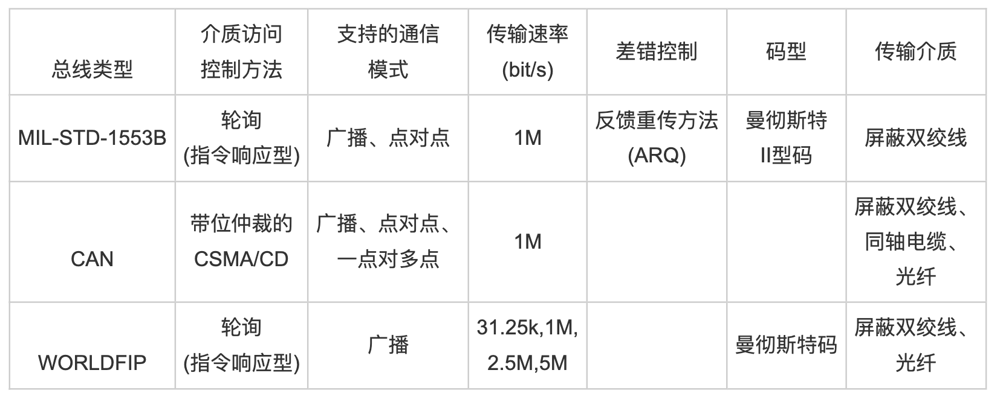

## 文献简介

| 题目         | 航空发动机分布式控制系统综述 |
| ------------ | :--------------------------: |
| 作者         |  西北工业大学郭迎清教授团队  |
| 刊物（评级） | 航空发动机（北大核心+WJCI）  |
| 时间         |          2003.09.30          |

+ 文章摘要：`分布式控制`是航空发动机控制发展的重要方向之一。分析了分布式控制在航空发动机控制中的应用 ,对航空发动机分布式控制系统的`结构`、`总线技术`及`智能装置`等关键问题做了系统阐述。

## 文献知识整理

### 集中控制系统缺点

1. 可靠性降低。系统中的全权限数字电子控制器(FADEC)除了要实现所有的信号采集、处理、控制算法运算、控制信号输出等主要功能以外,还要实现状态监控、故障检测、安全保护功能,这使得FADEC中的软件庞大而复杂,且系统对计算机利用率高,计算机一旦出现故障,整个系统都不能工作。
2. 控制系统重量过大。为了满足安全要求,FADEC和控制系统中的各传感器、伺服装置、执行机构之间是双绞线或是三绞线连接且相距较远,所以连接电缆及其绝缘层、保护层、连接器以及接头的重量占控制系统重量的较大部分。控制系统重量一般占整个发动机重量的15%～20%。
3. 集中式控制结构不利于发动机改型时控制系统的扩展。
4. 不利于维护。系统中电缆数目很多,有很多连接器和接头,因此系统的大部分问题与电气元件之间的机械连接故障有关,而且没有标准化的接口导致设备多样化、复杂。因此对于集中式控制系统来说,即使采用更先进的微处理器、更大容量的程序存储器,其性能也不会有大的提高。

### 分布式控制系统优点（一一对应）

1. 大大改善控制系统可靠性
2. 减少控制系统重量,尤其是电缆重量

3. 采用通用模块和标准接口，增强可扩展性
4. 每个智能装置都具有测试、识别功能,且采用通用型标准装置,因而大大降低了维护低了维护成本

### 分布式控制系统结构

### 总线技术（数据总线）对比

### 控制组件

#### 中央控制器（FADEC）

##### 功能

1. 对所有传感器和执行机构的信号进行采集和预处理
2. 控制算法运算
3. 控制信号输出
4. 故障检测
5. 安全保护

##### 输入量

1. 模拟量多达`20路以上`，一般包括`油门角度PLA信号`、`发动机各个截面的压力及温度信号`、`飞行高度H`、`马赫数Ma`等信号以及`执行机构的位置反馈电信号`
2. 频率量一般包括`转速$n_l$和$n_h$信号`
3. 开关量输入信号也多达`20路以上`，主要包括`启动按钮信号`、`加力点火检测信号`、`转入液压机械备份按钮信号`和`紧急停车按钮信号`等

> 从中央控制器硬件设计角度来看,上述输入信号都要经过输入接口电路,进行信号调理和转换后送入微处理器。同样,当中央控制器向执行机构输出控制量时,要经过输出接口电路,所以中央控制器中有很多输入/输出接口电路板,输入/输出接口的质量几乎占整个控制器的50%,故障占70%。

#### 智能器件

+ 包括智能传感器和智能执行机构

##### 智能传感器所具备的功能

1. 自动校正和自诊断
2. 对系统所有的输入量进行采集、转换和预处理
3. 余度管理

##### 智能执行机构所具备的功能

1. 闭环反馈控制
2. 自动校正和自诊断
3. 余度管理
4. 操作系统控制

>在FADEC系统的总定义中,用于故障检测、隔离和重新配置的余度管理和自检通常占总计算软件的40%～60%。在发动机DCS中,智能传感器和智能执行机构中的余度管理算法约占软件的70%。不同的是,在DCS中,对智能装置的余度管理是在智能装置中进行,这样可大大减轻中央控制器的计算负担,为中央控制器采用复杂的控制规律和先进的控制算法提供保证。

### 什么是余度管理（redundancy management）？（自查）

+ 定义：保证余度系统正确协调地工作、监控系统运行并完成故障检测及处理工作的功能的总称
+ 应用学科：航空科技（一级学科），飞行控制、导航、显示、控制和记录系统（二级学科）
+ 简单理解一下余度管理的作用：

以战机为例，一般电传操纵系统都采用余度备份系统。主要的传感器和飞行控制计算机都要留有几组完全相同且同时工作的系统，通过专门的余度管理计算机进行最后的输出。一般现代电传操纵系统都是4余度系统，也有少数3余度，或者采用解析余度的单余度系统。除了主要系统之外，电传操纵系统还留有被大大简化的备份系统。有些还留有机械备份。
